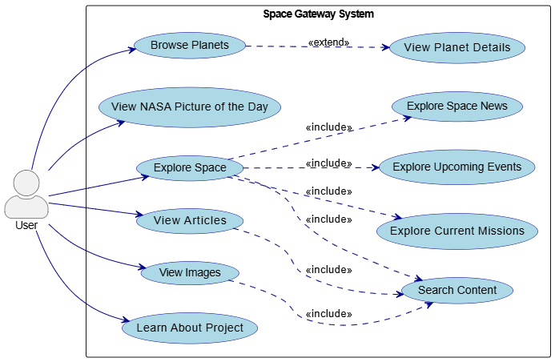
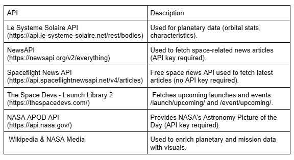

# 🚀 **Space Gateway**

**Space Gateway** is a modern full-stack web application that brings the wonders of space exploration to your fingertips. It provides real-time data on planets, space missions, astronomical events, the latest space news, and high-resolution imagery — all powered by live APIs and wrapped in an engaging, responsive UI.

---

## 🌐 Live Demo

*Coming soon...*

---

## 📚 Table of Contents

- [Features](#-features)
- [Pages Overview](#-pages-overview)
- [Use Case Diagram](#-use-case-diagram)
- [APIs Used](#-apis-used)
- [Tech Stack](#-tech-stack)
- [Setup Instructions](#-setup-instructions)
- [Usage](#-usage)
- [Perspectives and Improvements](#-perspectives-and-improvements)

---

## ✨ Features

- **Planet Details**: View detailed info and images of Solar System planets, including mass, radius, orbit, composition, and temperature.
- **NASA Picture of the Day**: Stay inspired with NASA’s daily astronomy photo.
- **Space Missions**: Track current and upcoming missions with launch dates, space agencies, and mission status.
- **Astronomical Events**: Discover upcoming celestial events with event type, timing, and descriptions.
- **Space News**: Read the latest space-related articles from trusted news sources.
- **Image Gallery**: Browse a curated collection of high-quality space imagery.
- **Search Functionality**: Find relevant articles, images, and mission data quickly.

---

## 🧭 Pages Overview

### 🏠 Home
- Displays NASA’s Astronomy Picture of the Day.
- Quick links to major features.
- Highlights featured space news and missions.

### 🪐 Planets
- Interactive planetary grid.
- View detailed stats and images via modal popup or detail page.
- Covers all major Solar System planets.

### 🔭 Explore
- **Missions**: View upcoming launches with mission details and imagery.
- **Events**: Explore current/future astronomical events by date and type.
- **News**: See recent developments in space exploration.

### 📖 Articles
- Collection of informative articles on space science and exploration.
- Search functionality to filter by keywords or topics.

### 🖼️ Images
- Gallery of curated high-resolution space images.
- Searchable by keywords.

### ℹ️ About
- Project goals and overview.
- Credits and contact information.

---

## 📈 Use Case Diagram

The following diagram illustrates the core functionalities of Space Gateway and how users interact with them:



---

## 🌐 APIs Used

| API | Endpoint(s) | Purpose |
|-----|-------------|---------|
| **Le Systeme Solaire API** | `https://api.le-systeme-solaire.net/rest/bodies` | Fetches detailed planetary data (mass, radius, orbit, composition, etc.). Used in `PlanetService`. |
| **NewsAPI** | `https://newsapi.org/v2/everything` | Retrieves space-related news articles. Used in `ArticlesService`. Requires API key. |
| **Spaceflight News API** | `https://api.spaceflightnewsapi.net/v4/articles` | Displays latest space exploration news. Public and free. |
| **Launch Library 2 API (The Space Devs)** | `https://ll.thespacedevs.com/2.2.0/launch/upcoming/`, `https://ll.thespacedevs.com/2.2.0/event/upcoming/` | Provides data on upcoming space missions and astronomical events. Used in `ExploreService`. |
| **NASA Media API** | NASA image endpoints (e.g. Astronomy Picture of the Day) | Supplies high-res media like daily pictures, used in Home and Gallery views. |
| **Wikipedia API** | Custom `https://en.wikipedia.org/w/api.php` calls | Complements missing planetary or mission data (e.g., images or descriptions). |


📌 **Note**: See the diagram below for a visual summary of the external APIs used.



---

## 🛠️ Tech Stack

### 🖥️ Frontend  
[](https://reactjs.org)  
[](https://www.typescriptlang.org)  
[](https://chakra-ui.com)  
[](https://axios-http.com)

---

### 🧠 Backend  
[](https://spring.io/projects/spring-boot)  
[](https://www.java.com)  
[](https://docs.spring.io/spring-framework/docs/current/javadoc-api/org/springframework/web/client/RestTemplate.html)

---

### ⚙️ Build Tools  
[](https://vitejs.dev)  
[](https://maven.apache.org)

---

### 🚢 Deployment  
[](https://www.docker.com)  
*Docker-ready setup, not yet deployed*


---

## ⚙️ Setup Instructions

### 🔧 Frontend Setup

The Frontend is connected to the port 3001.
```bash
# Clone the repository
git clone https://github.com/m-elhamlaoui/development-platform-astro-duo.git

# Navigate to frontend directory
cd development-platform-astro-duo/frontend

# Install dependencies
npm install

# Start development server and enter to the link that will show "https://localhost:3001"
npm run dev
```

### 🔧 Backend Setup

```bash
# Navigate to backend directory
cd ../backend

# Build the project
mvn clean install

# Run the application (e.g., SpaceGatewayApplication.java)
mvn spring-boot:run
```
## 🚀 Perspectives and Improvements
To ensure the continued scalability and adaptability of Space Gateway, several enhancements can be considered for future iterations:

### 🧱 Microservices Architecture
Refactor the current monolithic backend into independent microservices, such as:

- **Planet Service** – manages planetary data
- **Articles/News Service** – handles news and article aggregation
- **Missions/Events Service** – manages launches and celestial events
- **Images Service** – serves high-resolution images and NASA media

This modular approach enables:

- Independent development and scaling of each service
- Better fault isolation and maintainability
- Easier integration with other systems in the future

### ☁️ Deployment
Deploying the system with:

- Docker containers for each service
- Docker Compose or Kubernetes for orchestration
- CI/CD pipelines using GitHub Actions or Jenkins for seamless updates

This would support horizontal scaling and improve overall availability.


### 🔒 Secure Authentication
Implement OAuth2.0 and JWT-based authentication for:

- User login with Google, GitHub, etc.
- Secure access to personalized features and admin endpoints
